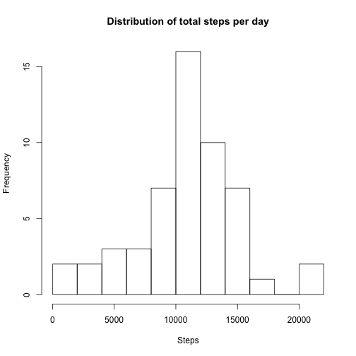
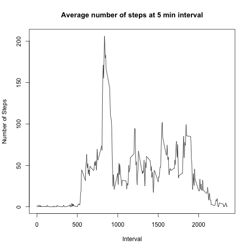
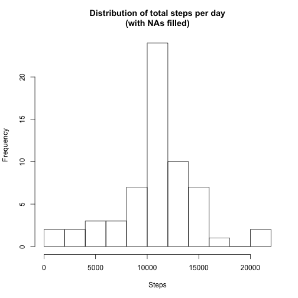
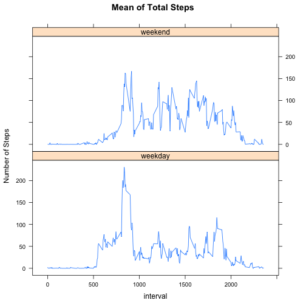

## Loading and preprocessing the data

Load the data from csv file.


```r
data <- read.csv("activity.csv")
dim(data)
```

```
## [1] 17568     3
```

```r
head(data)
```

```
##   steps       date interval
## 1    NA 2012-10-01        0
## 2    NA 2012-10-01        5
## 3    NA 2012-10-01       10
## 4    NA 2012-10-01       15
## 5    NA 2012-10-01       20
## 6    NA 2012-10-01       25
```

Process/transform the data into a format suitable for your analysis:  
1. Remove NA values  
2. Calculate total number of steps for each day


```r
library(reshape2)
dataNoNA <- data[!is.na(data$steps),]
stepsPerDay <- dcast(dataNoNA, date~., value.var='steps', fun.aggregate=sum)
names(stepsPerDay)[2] <- 'Steps' 
```

## What is mean total number of steps taken per day?

```r
mean(stepsPerDay$Steps)
```

```
## [1] 10766.19
```

For this part of the assignment, you can ignore the missing values in the dataset.

Calculate the total number of steps taken per day

Make a histogram of the total number of steps taken each day


```r
hist(stepsPerDay$Steps, n=10, xlab='Steps', main='Distribution of total steps per day')
```

 

Calculate and report the mean and median of the total number of steps taken per day


```r
summary(stepsPerDay$Steps);
```

```
##    Min. 1st Qu.  Median    Mean 3rd Qu.    Max. 
##      41    8841   10760   10770   13290   21190
```

## What is the average daily activity pattern?

Make a time series plot (i.e. type = "l") of the 5-minute interval (x-axis) and the average number of steps taken, averaged across all days (y-axis)


```r
meanSteps5min <- dcast(dataNoNA, interval~., value.var="steps", fun.aggregate=mean)
names(meanSteps5min)[2] <- 'meanSteps'
plot(meanSteps5min, type="l", main="Average number of steps at 5 min interval",
     xlab='Interval', ylab="Number of Steps")
```

 

Which 5-minute interval, on average across all the days in the dataset, contains the maximum number of steps?  

```r
meanSteps5min[which.max(meanSteps5min$meanSteps), 1]
```

```
## [1] 835
```

### Imputing missing values

Calculate and report the total number of missing values in the dataset (i.e. the total number of rows with NAs)


```r
sum(!complete.cases(data))
```

```
## [1] 2304
```

Create a new dataset that is equal to the original dataset but with the missing data filled in.  
**Strategy for filling in the NA values: using the mean value of the corresponding 5-minute interval**

```r
library(plyr)
NAidx <- is.na(data$steps)
NAintervals <- as.data.frame(data[NAidx,'interval'])
names(NAintervals) <- 'interval'
dataNAfilled <- data
dataNAfilled[NAidx,'steps'] <- join(NAintervals, meanSteps5min, by='interval')["meanSteps"]
```

Make a histogram of the total number of steps taken each day and Calculate and report the mean and median total number of steps taken per day. Do these values differ from the estimates from the first part of the assignment? What is the impact of imputing missing data on the estimates of the total daily number of steps?


```r
stepsPerDayNew <- dcast(dataNAfilled, date~., value.var='steps', fun.aggregate=sum)
names(stepsPerDayNew)[2] <- 'Steps' 
hist(stepsPerDayNew$Steps, n=10, xlab='Steps', main='Distribution of total steps per day\n(with NAs filled)')
```

 

```r
summary(stepsPerDayNew$Steps);
```

```
##    Min. 1st Qu.  Median    Mean 3rd Qu.    Max. 
##      41    9819   10770   10770   12810   21190
```

## Are there differences in activity patterns between weekdays and weekends?  
Create a new factor variable in the dataset with two levels – “weekday” and “weekend” indicating whether a given date is a weekday or weekend day.

```r
isWeekend <- weekdays(as.Date(dataNAfilled$date)) %in% c('Saturday','Sunday')
isWeekend <- isWeekend + 1 # use 1 for weekday and 2 for weekend
daytype <- c('weekday','weekend')
dataWithFactor <- cbind(dataNAfilled, daytype=daytype[isWeekend])
```
Make a panel plot containing a time series plot (i.e. type = "l") of the 5-minute interval (x-axis) and the average number of steps taken, averaged across all weekday days or weekend days (y-axis).  


```r
library(lattice)
meanSteps5minByFactor <- dcast(dataWithFactor, interval~daytype, value.var="steps", fun.aggregate=mean)
meanSteps5minByFactor <- melt(meanSteps5minByFactor, measure.vars=c('weekday','weekend'), variable.name='daytype',value.name='steps')
with(meanSteps5minByFactor, xyplot(steps~interval|daytype, type='l',
     layout=(c(1,2)), ylab='Number of Steps', main='Mean of Total Steps'))
```

 
